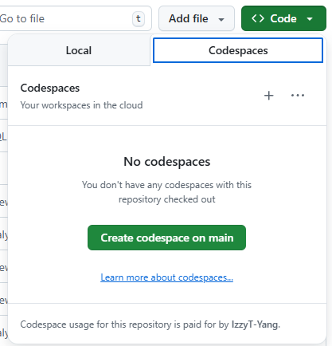
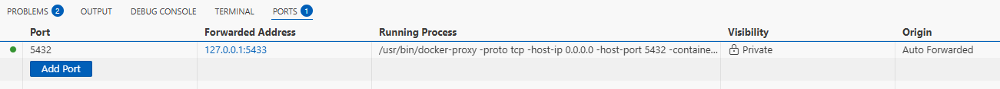
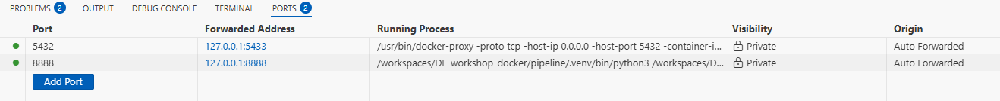
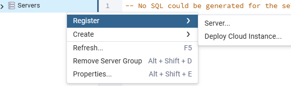
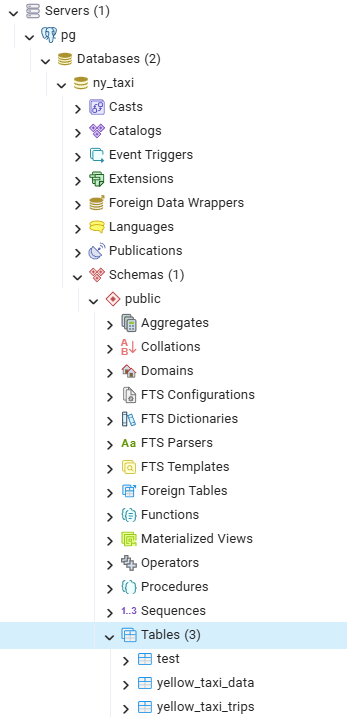

Based on https://github.com/DataTalksClub/data-engineering-zoomcamp/tree/main/01-docker-terraform/docker-sql

# Project Workflow

- Create github repo, open in codespace
- Create ./pipeline folder
    - Initiate project structure with `uv init --python 3.13`
    - Add necessary packages with `uv add pandas pyarrow`, this also automatically creates a venv
    - Add Dockerfile to create the correct docker image
    - Build image with the Dockerfile using `docker build`
    - Run the container with parameters to trigger the file using `docker run`
- Add and commit changes to git (ongoing)
- Run postgres sql as container
- Ingest data into postgres with Python script
- Make the script part of the Dockerfile and build image with it. Run everything under one bridge network
- Use pdAdmin for better UI
- Use docker-compose for better image management (use AI to help)

# Knowledge

## Github repo and codespaces

After creating a github repo, go to code > create codespace



> GitHub Codespaces is a cloud-based code editor that runs in your browser. Instead of coding on your local machine, you code in a remote Docker container hosted by GitHub. You can still run Docker inside of this Docker container
>
> You can check the system it's using with `lsb_release -a`
>
> In command palette, you can select open in desktop VS code.

The **git workflow** with codespace is easier. When you create a Codespace from that repo, it already has:

- the repo cloned
- origin remote set
- auth configured

, so you will only need to do:

```
git status
git add .
git commit -m "Your message"
git push
```

Without codespaces, you need to:

```
git init
git add .
git commit -m "Initial commit"
git branch -M main
git remote add origin https://github.com/<you>/<repo>.git
git push -u origin main
```

## Basic `docker run` options

`docker run hello-world`: testing image to make sure docker is working

### -it

`docker run ubuntu`: if you run like this it will exit immediately because there's no **interactive terminal** attached. To make sure it works interactively, run `docker run -it ubuntu`, where

- `-i` stands for interactive
- `-t` stands for terminal

`docker run -it python:3.13.11`: install and run interactively this specific python image version. 

> Without the content after ":", the version will default to "latest". You can check all installed images using `docker image ls` 

### --entrypoint

Some images by default open bash and other open python terminal. This is defined by **CMD and/or ENTRYPOINT** in the image’s Dockerfile. You can view it with `docker image inspect <image>` (look at Config.Entrypoint and Config.Cmd).

For example, the Dockerfile for python has:

```json
"Config": {
   "Cmd": [
       "python3"
   ],
   "Entrypoint": null,
```

This means after running the OS for this image it runs python3 immediately, causing us to see the python interface

This can be **overwritten with `--entrypoint` parameter**, like: `docker run -it --entrypoint=bash python:3.13.11-slim`

### -v

To allow docker to see files in host machine, use "volume", which is set up with `-v`.

There are two types of volumne: 

- Bind mount (`<local_absolute_dir>:<dir_inside_docker>`)

  This is for local dev, editing files, sharing code.

  ```bash
  docker run -it \
      --rm \
      -v $(pwd)/test:/app/test \ # this line maps the test folder in host (left) to the app/test folder in container (right)
      --entrypoint=bash \
      python:3.9.16-slim
  ```
- Named volume (`<volume_name>:<container_path>`)

  This is for database, persistent app state, portability across machines

  ```bash
  docker run -it --rm \
    -e POSTGRES_USER="root" \
    -e POSTGRES_PASSWORD="root" \
    -e POSTGRES_DB="ny_taxi" \
    -v ny_taxi_postgres_data:/var/lib/postgresql \ # this line maps a name to a dir in container. The actual file in host will be saved in somewhere like "/var/lib/docker/volumes/ny_taxi_postgres_data/_data"
    -p 5432:5432 \
    postgres:18
  ```

Note that the paths in mapping need to be the **absolute path**, so this works: `-v $(pwd)/test:/app/test`, but this doesnt: `-v test:/app/test`.

### -p

To map port in container to port in host, syntax: `-p <host_port:container_port>`, like `-p 5432:5432`.

### --rm

`docker run test:pandas --rm`: Automatically remove the container and its associated anonymous volumes when it exits. i.e. you can't find it in `docker ps -a`

### run with arguments

When Dockerfile has: `ENTRYPOINT ["python", "pipeline.py"]`, and pipeline.py uses `sys.argv[1]`, to make the python script work, you need to pass in parameters. In that case, run:

`docker run -it test:pandas 11`

This is the same thing as if ENTRYPOINT is ["python", "pipeline.py", "11"]. Reversely, you can also overwrite ENTRYPOINT with --entrypoint, and manually input params in bash.

## Other docker commands

- `docker run`: see above
- `docker build`: build image based on Dockerfile
    - `docker build -t <[registry/]repository[:tag]> .`: assign tag to the image; "." means read the Dockerfile in current dir
- `docker image`: manage images
    - `docker image ls`: list images
- `docker ps`: list live containers
    - `docker ps -a`: list all containers
    - `docker ps -q`: list live containers, only show IDs 
    - `docker ps -aq`: list all containers, only show IDs 
- `docker rm <container-id>`: remove a stopped container from `docker ps -a`
    - `docker rm $(docker ps -aq)`: remove a stopped container from `docker ps -a`. This format `$(<command>)` replaces the param with the output of the command.
- `docker network`: check all docker networks

## Basic linux commands

- `mkdir test`: create a dir called test
- `touch file1.txt file2.txt file3.txt`: create empty files
- `echo "hello from host" > file1.txt`: echo prints text to the terminal or a file
- `cat file1.txt`: prints file contents to the terminal.

## uv for Python version & venv management

Used in https://github.com/DataTalksClub/data-engineering-zoomcamp/blob/main/01-docker-terraform/docker-sql/02-virtual-environment.md

1. `pip install uv` install uv
1. `uv init --python 3.13`: creates the project scaffold (not a venv)
1. `uv run python -V`: runs "python -V" in the uv enviroment. This looks at the .python-verison file in the folder. This should return 3.13

   - This doesn't create the venv
1. `uv add pandas pyarrow`: automatically creates a .venv folder (and thus creates a venv), adds two packages to venv as well as the "dependencies" section in pyproject.toml

   - In comparison, `uv pip install` doesn't add files to .toml file 

After this, in VS code select Python interpreter as the .venv/bin/python file in project folder (enter interpreter path > select the correct file):


## Dockerfile

https://github.com/DataTalksClub/data-engineering-zoomcamp/blob/main/01-docker-terraform/docker-sql/03-dockerizing-pipeline.md

https://docs.docker.com/reference/dockerfile/

By using the uv.lock file for environments, it ensures the product env and image are exactly the same. 

## Run postgres SQL in container

Start container with named volume

```
docker run -it --rm \
  -e POSTGRES_USER="root" \
  -e POSTGRES_PASSWORD="root" \
  -e POSTGRES_DB="ny_taxi" \
  -v ny_taxi_postgres_data:/var/lib/postgresql \
  -p 5432:5432 \
  postgres:18
```

You will see this in port after this:



Add python package: pgcli. It is a command-line client for PostgreSQL with auto-completion and syntax highlighting.

```bash
uv add --dev pgcli
```

> We use `--dev` to add this package to this part of the pyproject.toml file since it's not used in production. 
>
> ```
> [dependency-groups]
> dev = [
>     "pgcli>=4.4.0",
> ]
> ```

Run pgcli:

```bash
uv run pgcli -h localhost -p 5432 -u root -d ny_taxi
```

Run psql commands:

```sql
-- List tables
\dt

-- Create a test table
CREATE TABLE test (id INTEGER, name VARCHAR(50));

-- Insert data
INSERT INTO test VALUES (1, 'Hello Docker');

-- Query data
SELECT * FROM test;

-- Exit
\q
```

## Ingest data with Python + Jupyter Notebook

Add and run jupyter notebook

``` bash
uv add --dev jupyter
uv run jupyter notebook
```

After this there'll be 8888 in ports



You can open it in browser from there. (I think it's also ok to just open in vscde and select the correct kernal for now) In jupyter notebook, create a new ipynb notebook. Import and explore data there. (Refer to the actual file for details)

Split data to chunks with:

``` python
df_iter = pd.read_csv(
    filepath,
    dtype=dtype,
    parse_dates=parse_dates,
    iterator=True,
    chunksize=100000 # Note this
)
```

This returns an iterable object (not a DF anymore) so it saves memory. Use `tqdm` package to monitor progress of ingestion. Ingest with:

``` python
for df_chunk in tqdm(df_iter):
    print(len(df_chunk))
    df_chunk.to_sql(name='yellow_taxi_data', con=engine, if_exists='append', index=False)
```

Finally, change the ipynb file to a script using:

``` bash
uv run jupyter nbconvert --to=script notebook.ipynb
```

This creates notebook.py (renamed to ingest_data.py). Modify the py file to make it a proper parameterized script with

``` python
if __name__ == "__main__":
    main()
```

and also allow CLI param input using `click`

and run with 

``` bash
uv run python ingest_data.py \
  --pg-user=root \
  --pg-pass=root \
  --pg-host=localhost \
  --pg-port=5432 \
  --pg-db=ny_taxi \
  --target-table=yellow_taxi_trips
```

## Put script into Dockerfile, build and run the image

``` bash
cd pipeline
docker build -t taxi_ingest:v001 .

docker network create pg-network

# run postgres with network and name
docker run -it --rm \
  -e POSTGRES_USER="root" \
  -e POSTGRES_PASSWORD="root" \
  -e POSTGRES_DB="ny_taxi" \
  -v ny_taxi_postgres_data:/var/lib/postgresql \
  -p 5432:5432 \
  --network=pg-network \
  --name pgdatabase \
  postgres:18

# run pipeline container with network and hostname
# note how this doesnt have a -p since it doesnt need to be seen
docker run -it \
  --network=pg-network \
  taxi_ingest:v001 \
    --pg-user=root \
    --pg-pass=root \
    --pg-host=pgdatabase \
    --pg-port=5432 \
    --pg-db=ny_taxi \
    --target-table=yellow_taxi_trips
```

## pgAdmin

Run in the same network with a name

``` bash
docker run -it \
  -e PGADMIN_DEFAULT_EMAIL="admin@admin.com" \
  -e PGADMIN_DEFAULT_PASSWORD="root" \
  -v pgadmin_data:/var/lib/pgadmin \
  -p 8085:80 \
  --network=pg-network \
  --name pgadmin \
  dpage/pgadmin4
```

Log into pgadmin at localhost:8085.

- Create a server
  
  

- Set: name = "pg", host name = "pgdatabase" (same as what was defined in the postgres container), port = 5432, username = "root", pwd = "root" 

- Under it you can see the previously created tables

  

# docker-compose.yaml

You can use docker compose to manage the pgadmin and postgres sql containers. After it's up you can run the custom pipeline container as usual.